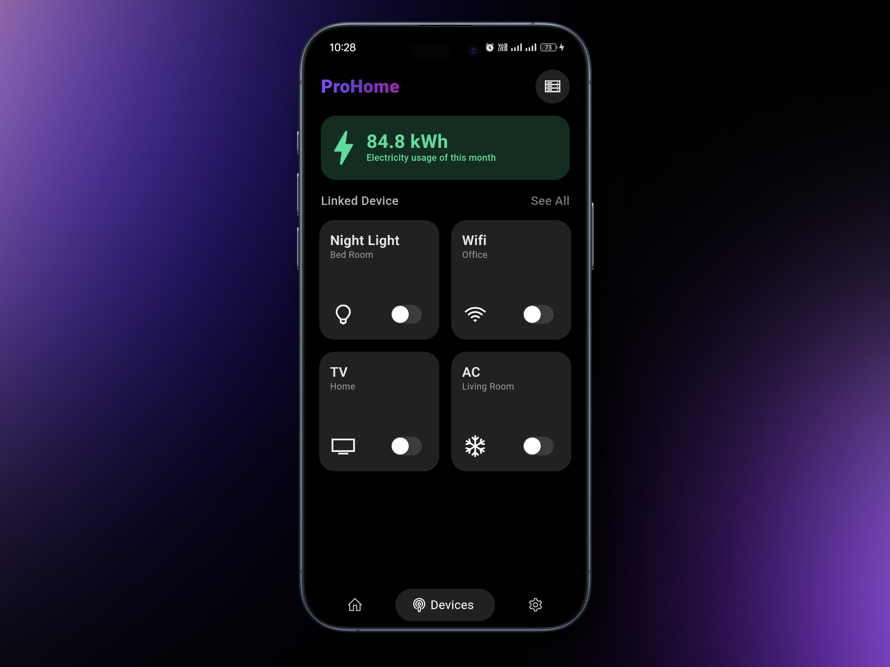

# IoT Smart Home App

## Overview

This project is an Internet of Things (IoT) Flutter application that allows users to interact with and control connected devices seamlessly. The app provides a user-friendly interface to monitor and manage IoT devices, making it easy for users to stay connected to their smart environments.

## Features

- **Device Control**: Control IoT devices remotely through the app. Turn devices on/off.

- **Real-time Monitoring**: View real-time data and status updates from connected devices. Stay informed about the current state of your IoT ecosystem.

- **Intuitive Ui**: A clean and intuitive Ui design for easy navigation and a pleasant user experience.

- **Device Compatibility**: Connect with a variety of IoT devices, supporting different protocols and communication standards.

## Technologies Used

- **Flutter**: The app is built using the Flutter framework, allowing for a single codebase for both Android and iOS platforms.
- **Dart**: The programming language used for developing the Flutter app.
- **IoT Protocols**: Implement industry-standard IoT protocols for seamless communication with connected devices.
- **Flask and MicroPython for Server** : Utilize Flask as the backend server framework and MicroPython for microcontroller-based IoT devices.

## Getting Started

This project is a starting point for a Flutter application.

A few resources to get you started if this is your first Flutter project:

- [Lab: Write your first Flutter app](https://docs.flutter.dev/get-started/codelab)
- [Cookbook: Useful Flutter samples](https://docs.flutter.dev/cookbook)

For help getting started with Flutter development, view the
[online documentation](https://docs.flutter.dev/), which offers tutorials,
samples, guidance on mobile development, and a full API reference.

### Preview

